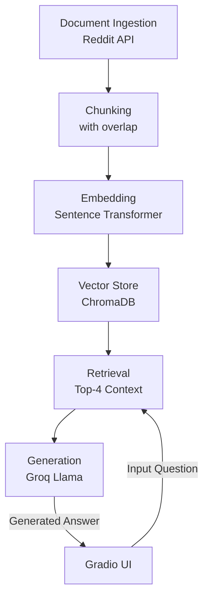

# Project 1 Planning: The Unofficial Guide

> Write this document before you write any pipeline code.
> Your spec and architecture diagram are what you'll use to direct AI tools (Claude, Copilot, etc.) to generate your implementation — the more specific they are, the more useful the generated code will be.
> Update the Retrieval Approach and Chunking Strategy sections if you change your approach during implementation.
> Update this file before starting any stretch features.

---

## Domain

What domain did you choose? 
- The chosen domain is the Unofficial GWU Freshman Computer Science Student Survival Guide. It provides a student-to-student playbook covering introductory CS class rigor, local tech internship navigation, freshman housing choices,dining realities, course registration, and urban campus adaptation at George Washington University.

Why is this knowledge valuable and hard to find through official channels? 
- This knowledge is valuable because it helps incoming students set realistic expectations, make informed decisions about their academic and social lives, and navigate the unique challenges of being a freshman in a large urban university setting. It can reduce anxiety, improve student satisfaction, and enhance the overall college experience by providing practical advice that is not available through official channels. It can also foster a sense of community and support among new students by sharing insights from those who have recently gone through similar experiences.

- The information is hard to find through official channels because it is often anecdotal, subjective, and rapidly changing based on student experiences, which are not typically documented in formal university resources. By compiling this knowledge into a single guide, it provides a more comprehensive and accessible resource for new students. 
---

## Documents

The Unofficial GWU Freshman Computer Science Student Survival Guide.

| # | Source | Description | URL or location |
|---|--------|-------------|-----------------|
| 1 | Reddit | Pacing and rigor of early computer science classes. | https://www.reddit.com/r/gwu/comments/1dxy9a3/how_is_the_computer_science_at_gwu_incoming/ |
| 2 | Reddit | Local tech market jobs and student internships. | https://www.reddit.com/r/gwu/comments/1b2u2ih/cs_jobs/ |
| 3 | Reddit | Student life inside the engineering department. | https://www.reddit.com/r/gwu/comments/62m1d2/computer_science_at_gw/ |
| 4 | Reddit | How the freshman housing lottery works. | https://www.reddit.com/r/gwu/comments/1pyc0s6/how_to_get_the_dorm_you_want_as_a_first_year/ |
| 5 | Reddit | Living on the Mount Vernon campus. | https://www.reddit.com/r/gwu/comments/1k6aax4/chances_of_residence_hall_i_want/ |
| 6 | Reddit | Finding centrally located freshman dorms. | https://www.reddit.com/r/gwu/comments/gwsp0i/gwu_housing/ |
| 7 | Reddit | Swapping rooms if the lottery fails. | https://www.reddit.com/r/gwu/comments/8ouwev/i_didnt_get_any_of_my_15_housing_choices/ |
| 8 | Reddit | Social environments of different residence halls. | https://www.reddit.com/r/gwu/comments/1jvbdjc/incoming_student_housing_questions/ |
| 9 | Reddit | Strategy hacks for high-stress class registration. | https://www.reddit.com/r/gwu/comments/i34t90/registration_tipschances/ |
| 10 | Reddit | Brutally honest reviews of campus dining halls. | https://www.reddit.com/r/gwu/comments/1bw4x7a/my_honest_review_on_gw_dining/ |
| 11 | Reddit | Secret quiet spots to study on and off campus. | https://www.reddit.com/r/gwu/comments/1kh4lqw/favorite_study_spots/ |
| 12 | Reddit | Moving in, making friends, and freshman dorm advice. | https://www.reddit.com/r/gwu/comments/14kcb90/general_advice_for_freshmen/ |
| 13 | Reddit | Honest breakdown of Greek life vs. DC nightlife options. | https://www.reddit.com/r/gwu/comments/1b8b92n/social_scene_in_gw/ |
| 14 | Reddit | Navigating the D.C. Metro system and going carless. | https://www.reddit.com/r/gwu/comments/1may8rf/commuting_by_metro/ |
| 15 | Reddit | Campus safety, city life tips, and night walking alerts. | https://www.reddit.com/r/gwu/comments/137uaqr/campus_safety/ |

---

## Chunking Strategy

<!-- How will you split documents into chunks?
     State your chunk size (in tokens or characters), overlap size, and explain why those
     numbers fit the structure of your documents.
     A review-heavy corpus warrants different chunking than a long FAQ. -->

**Chunk size: 500**
The 500-character chunk size allows for capturing complete thoughts and advice without splitting sentences or key information across chunks. This is particularly important for Reddit posts, which often contain multiple paragraphs of advice and discussion. A smaller chunk size might split important context, while a larger chunk size could make retrieval less precise.

**Overlap: 100**
The 100-character overlap handles edge cases where key proper nouns (such as specific residence halls like Thurston or District, or specific course codes like CSCI 1111) occur near split boundaries, guaranteeing that either adjacent chunk retains enough surrounding semantic context to be matching and retrievable.

**Reasoning:**
These documents are Reddit posts, which can vary in length but often contain multiple paragraphs of advice and discussion, a chunk size of 500 characters allows for capturing complete thoughts and advice without splitting sentences or key information across chunks. An overlap of 100 characters ensures that if a piece of advice or a key point is near the boundary of a chunk, it will still be included in the next chunk, preserving context and improving retrieval accuracy when answering specific questions. This approach balances the need for manageable chunk sizes with the importance of maintaining coherent information for effective retrieval.

---

## Retrieval Approach

<!-- Which embedding model are you using (e.g., all-MiniLM-L6-v2 via sentence-transformers)?
     How many chunks will you retrieve per query (top-k)?
     If you were deploying this for real users and cost wasn't a constraint, what tradeoffs
     would you weigh in choosing a different embedding model — context length, multilingual
     support, accuracy on domain-specific text, latency? -->

**Embedding model: all-MiniLM-L6-v2 via sentence-transformers**
This model is a good choice for our use case because it provides a good balance of accuracy and efficiency for general-purpose text embeddings. It runs locally and eliminates API costs, rate limits. It captures semantic meaning effectively, which is important for retrieving relevant chunks of advice from the Reddit posts.

**Top-k: 4**
Retrieving 4 chunks provides a balance of up to ~2,000 characters of total context, giving the Groq LLM multiple student opinions to synthesize without overwhelming its context window or risking dilution from lower-scoring, irrelevant text chunks. This is especially important given the variety of topics covered in the Reddit posts, as it increases the likelihood of retrieving useful and diverse pieces of advice for each question.

**Production tradeoff reflection:**
If deploying this for thousands of real users without cost limits, a paid API model (like OpenAI's `text-embedding-3-small`) would be considered to handle longer context windows and provide higher multi-lingual semantic matching density, though at the expense of slight API latency and operational costs.

---

## Evaluation Plan

<!-- List your 5 test questions with their expected correct answers.
     Questions should be specific enough that you can judge whether the system's response
     is right or wrong. "What are good dining halls?" is too vague.
     "What do students say about wait times at [dining hall name] during lunch?" is testable. -->

| # | Question | Expected answer |
|---|----------|-----------------|
| 1 | What do students say about the pacing and rigor of early computer science classes at GWU? | Students describe the early CS classes as challenging but survivable; they recommend checking Rate My Professor to scope out professors in advance, and note that smaller class sizes can be an advantage compared to large state schools. |
| 2 | Is the freshman housing lottery actually random, or does the placement matrix favor certain preferences? | The lottery is effectively random — students should rank Foggy Bottom dorms first and Vern dorms last, but placement is not guaranteed. Room-swapping after the semester starts is the main fallback option. |
| 3 | What are the best strategies for navigating the high-stress course registration process at GWU? | Pre-load all CRNs in a notes app or split-screen with the registration portal, register for UW (University Writing) courses first since they have the smallest sections, prepare multiple backup schedules, and consider using keyboard macros to speed up CRN entry. |
| 4 | What are the realistic pros and cons of living on the Mount Vernon campus versus Foggy Bottom dorms like Thurston Hall? | Vern pros: quieter environment, forces healthy routines, sense of camaraderie among residents, chance at a single room. Vern cons: isolated, dependent on the VEX shuttle, no 24-hr library access. Foggy Bottom pros: central, walkable to classes and DC amenities, social energy. Foggy Bottom cons: louder, more cramped dorms. |
| 5 | What do students say about the quality and variety of food at GWU dining halls? | Quality is described as "decent at best, borderline dangerous at worst" — mushy chicken, stale bread, undercooked rice, and cases of inedible materials have been reported. Freshman meal plans (~$3,000) are mandatory, removing student choice. Highlights include Thurston omelettes, Halal Shack, and the Indian place at USC as the better options. |

---

## Anticipated Challenges

<!-- What could go wrong? Name at least two specific risks with reasoning.
     Consider: noisy or inconsistent documents, missing source attribution, off-topic
     retrieval, chunks that split key information across boundaries. -->

1. Noisy or inconsistent documents: Reddit posts can vary widely in quality, length, and relevance. Some posts may contain off-topic discussions, personal anecdotes that are not broadly applicable, or even misinformation. This could lead to the retrieval of irrelevant or low-quality chunks, which would affect the accuracy of the generated answers.

2. Missing source attribution: If the system does not properly attribute information to its sources, it could lead to confusion about the origin of the advice and potentially mislead users. This is especially important in a student survival guide context, where the credibility of the advice is crucial. If users cannot trace back the information to its source, they may question its validity or fail to understand the context in which it was given.

3. off-topic retrieval: Given the variety of topics covered in the Reddit posts, there is a risk that the retrieval process may pull in chunks that are not directly relevant to the specific question being asked. This could lead to answers that are less focused and potentially confusing for users.

4. Chunks that split key information across boundaries: If important information is split across two chunks due to the chunking strategy, it may lead to incomplete retrieval of relevant information. This could result in answers that are missing critical context or details, which would affect the overall quality and usefulness of the generated responses.

---

## Architecture

<!-- Draw a diagram of your pipeline showing the five stages:
     Document Ingestion → Chunking → Embedding + Vector Store → Retrieval → Generation
     Label each stage with the tool or library you're using.
     You can use ASCII art, a Mermaid diagram, or embed a sketch as an image.
     You'll use this diagram as context when prompting AI tools to implement each stage. -->

---

## AI Tool Plan

<!-- For each part of the pipeline below, describe:
     - Which AI tool you plan to use (Claude, Copilot, ChatGPT, etc.)
     - What you'll give it as input (which sections of this planning.md, which requirements)
     - What you expect it to produce
     - How you'll verify the output matches your spec

     "I'll use AI to help me code" is not a plan.
     "I'll give Claude my Chunking Strategy section and ask it to implement chunk_text()
     with my specified chunk size and overlap" is a plan. -->

**Milestone 3 — Ingestion and chunking:**

- I will use Claude to help me implement the document ingestion and chunking stages of the pipeline. I will provide it with the Document Ingestion and Chunking Strategy sections of this planning document, along with specific requirements for chunk size and overlap.

- I expect Claude to produce two Python functions 
   - load_documents() : that can fetch the content from the specified Reddit URLs and return it in a structured format.
   - chunk_document() : that can ingest documents from the specified Reddit URLs, split them into chunks according to the defined strategy, and handle edge cases with proper overlap.

- I will verify the output by testing the function on a sample Reddit post and checking that the resulting chunks are correctly sized, contain the expected overlap, and that key information is not split across chunk boundaries. I will also ensure that the function can handle multiple documents and produces consistent results.

**Milestone 4 — Embedding and retrieval:**
- I will use Claude to assist in implementing the embedding and retrieval stages. I will provide it with the Retrieval Approach section of this planning document, along with the specific requirements for the embedding model and top-k retrieval.

- I expect Claude to produce three Python functions:
   - get_collection() : that initializes and returns a ChromaDB collection for storing embeddings.
   - embed_and_store() : that takes the chunks produced by the chunking stage and generates embeddings using the specified model and stores them in the vector store.
   - retrieve_chunks(query, top_k) : that takes a user query, retrieves the top-k relevant chunks from the vector store based on their embeddings, and returns them for generation.

- I will verify the output by testing the embedding and retrieval functions with sample chunks and queries, ensuring that the correct chunks are retrieved based on semantic similarity and that the embeddings are generated correctly.

**Milestone 5 — Generation and interface:**
- I will use Claude to help implement the generation stage and the Gradio interface. I will provide it with the Generation section of this planning document, along with the specific requirements for how the retrieved chunks should be synthesized into a coherent answer.

- I expect Claude to produce the following:
   - generate_answer(retrieved_chunks) : that takes the retrieved chunks and uses the Groq Llama model to synthesize them into a coherent answer to the user's question.
   -Also ask Claude to create a Gradio interface that can accept user input, and display generated answers.
   
- I will verify the output by testing the generation function with sample retrieved chunks to ensure that it produces coherent and relevant answers. I will also test the Gradio interface to confirm that it correctly accepts user input, triggers the retrieval and generation process, and displays the generated answers appropriately.